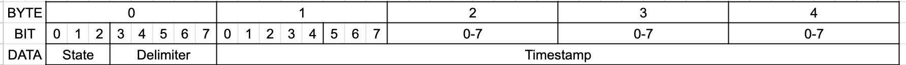
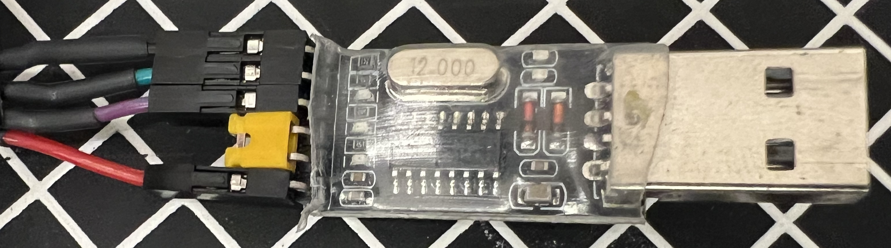

# Timing Data Collection
This project uses a the BluePill STM microcontroller to collect data from analog circuitry for further data analysis.

It uses platformIO and the arduino framework for code.

## Timing test
The most simple test is as follows -
1. A user presses a button.
2. The button causes the solenoid to trigger and shot the launcher.
3. The STM sends data via serial port
4. Test stops automaticlly when the STM 

This test is already implemented in TimingClient.ipynb

## Serial Communication information
The serial communiation is done via a 7 byte packet at a time that the STM controls.
The packet is broken as follows - 
1. 3 MSB of 0th byte - state/stage identifier
2. 5 LSB of 0th byte - delimiter
4. byte 1-4 - timestamp in microseconds from the arduino




### State identifiers
```python
START_TEST        = 0b100       # Test procedure starts
BEFORE_SOLENOID   = 0b001       # Timestamp right before solenoid trigger
AFTER_SOLENOID    = 0b010       # Timestamp right after solenoid trigger
BEAM_READ         = 0b011       # Analog read of beam breaker
END_TEST          = 0b110       # Test procedure ended
```

A test can have multiple stages. The test as a whole is indicated by START_TEST, and END_TEST;

## BluePill Connections

### Programming the BluePill
In order to program the BluePill use the ST-LINK V2.
Connect the following - 
1. SWDIO
2. GND
3. SWCLK
4. 3.3V

### Serial Communication
For the serial communication, use a USB to TTL module. 


USB to TTL BluePill Connection - 
1. 5V  (RED) to 5V
2. TXD (PURPLE) to pin A10
3. RXD (GREEN) to pin A9
4. GND (BLAKC) to GND

### Test Connection
The following modules are used in this test -

1. Beam Breaker Circuit 
2. ADC
3. Solenoid Control Module

NOTE: Everything *must* be connected to the same ground.

#### Beam Breaker 
The beam breaker circuit invovles the following connections -
1. VCC - recommended is 3.3/5V
2. Phototransistor connection with a variable resistor - recommended 180Ω

